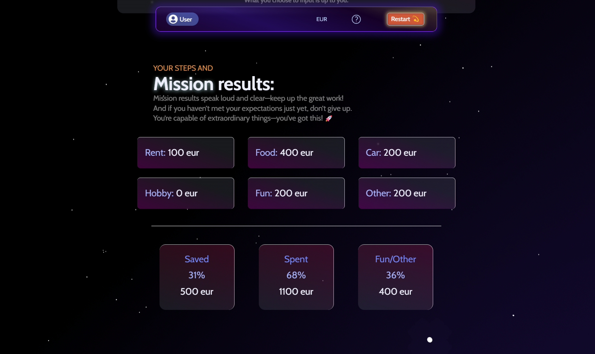
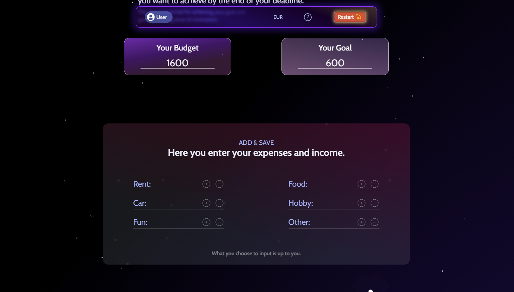
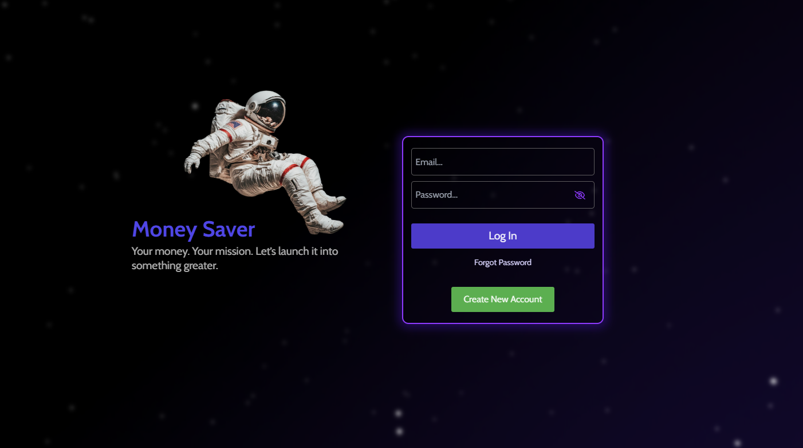
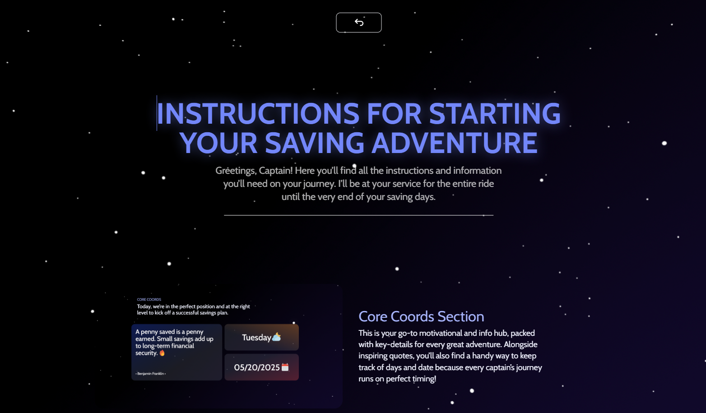
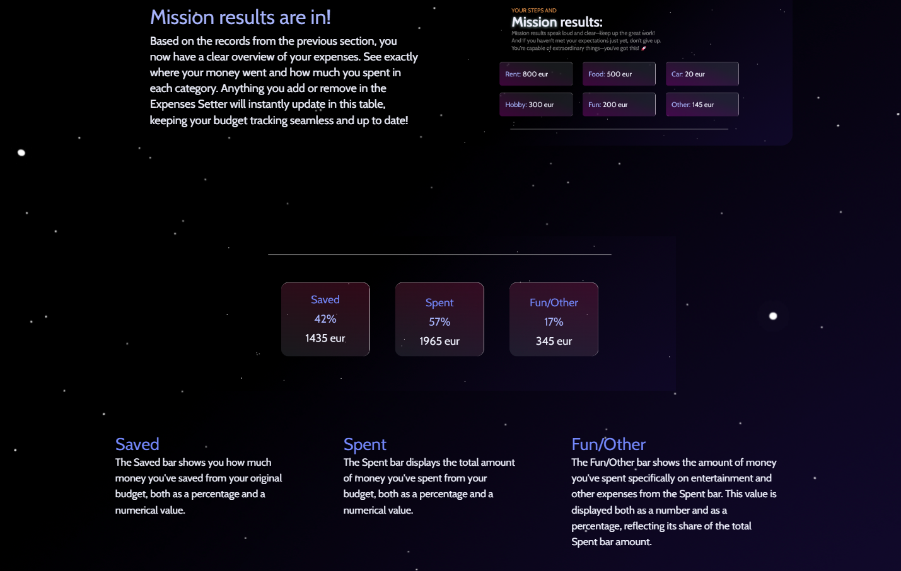

# Money Saver App

**Money Saver App** is a modern tool designed to support personal finance management and effective money-saving habits.  
Set your budget, categorize your expenses, and track exactly where your money goes — all in a sleek, space-themed environment.

## The app allows you to:

- **Define your budget** and distribute your spending across six customizable categories  
- **Visualize your expenses** using clear numeric and percentage-based breakdowns  
- **Gain financial insight** through three main spending areas that highlight key expenditure trends  
- **Sign in securely** with individual user authentication and keep your data private and personalized  
- **Access your financial data** from any device thanks to seamless cloud synchronization  
- **Edit, reset, or delete** your data anytime to stay in full control of your finances

## 🚀 Live Demo

[Check out the live demo here](https://kubanec01.github.io/Money_Saver_App/)

## 🧭 Overview
- [Technologies Used](#-technologies-used)
- [Secure & Personalized Access](#-secure-and-personalized-access)
- [Clear Guidance with Info Page](#-clear-guidance-with-info-page)
- [Installation](#-installation)

## 💻 Technologies Used

- React + Vite  
- TypeScript  
- Firebase 
- i18n 
- Tailwind CSS  
- Framer Motion  

## 🔐 Secure And Personalized Access
   

   ##

Every user can create a personal account with a **unique username**, **Gmail address**, and **password**. Once registered, users can **log in anytime** and **access their data — no matter where they are**.

**Forgot your password?** No worries. The app allows you to **request a recovery email** and **easily reset your password**. If you're already logged in, you can also **change your password directly within the app — quickly and securely**.

Thanks to this system, you can be confident that your **financial data is always up-to-date**, **synchronized**, and **securely tied to your personal account**. All input is **safely stored in the cloud**, giving you **full control of your budget from any device**.
##

## 🧠 Clear Guidance with Info Page
   
      

##

While the app might seem a bit overwhelming at first, it's actually designed with **simplicity and user-friendliness** in mind. Thanks to the **well-organized Info Page**, you'll find all the essential guidance on how to use the app — **clearly, briefly, and without any unnecessary complexity**.

Whether you're opening the app for the first time or just need a quick refresher, the Info Page is always there to **help you get back on track**. There’s beauty in simplicity, which is why all instructions are delivered in a **straightforward and understandable way**.
  ##    

## 🔧 Installation

To run the project locally, follow these steps:

1. Clone the repository:

   - `git clone https://github.com/Kubanec01/Money_Saver_App.git`

2. Navigate to the project directory:

   - `cd Money-Saver-App`

3. Install the dependencies:

   - `npm install`

4. Run the app locally:
   - `npm run dev`

Once the app is running, open your browser and go to `http://localhost:5173/` to view the app in action.

   
